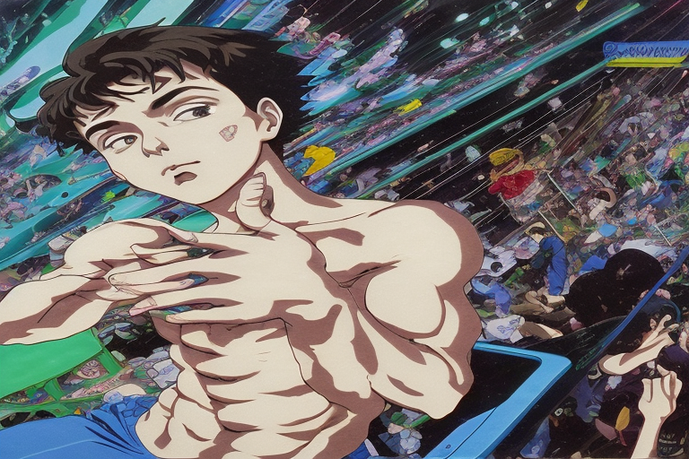
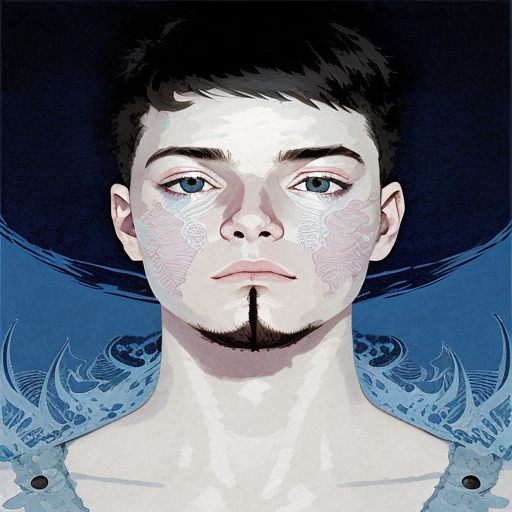

<h2 align="center">📋&ensp; <i>Ｓｏｂｒｅ</i> &ensp;📋</h2>

  

  <ul align="left" style="padding-right: 340px;">
    <li>🗿 Tecnologia, academia, café e códigos. 🍷</li> 
    <li>🗿 Me chamo Vitor, inicando na programação em  01/2023, atualmente iniciando e aprendendo, quanto mais absorvo, mais fico focado, principalmente quando é algo que me interesso 🍷</li> 
    <li>🗿 Meu objetivo no futuro próximo, é me tornar um Desenvolvedor Full-stack (Frontend e Backend). 🍷</li> 
    <li><i>🕊️ "Alis volat propriis" 🕊️</i></li> 
  </ul>
      

<h2 align="center">👨🏻‍💻&ensp; <i>Ｐｒｏｊｅｔｏｓ</i> &ensp;👨🏻‍💻</h2>

  
  
  <table height="365px" width="365px">
    <tr>
      <td>
      
      </td>
    </tr>
    <tr>
      <td>
      
      </td>
    </tr>
        <tr>
      <td>
      
      </td>
    </tr>
    <tr>
      <td>
      
      </td>
    </tr>
    <tr>
      <td>
      
      </td>
    </tr>
  </table>

  

<h2 align="center">🛠️&ensp; <i>Ｔｅｃｎｏｌｏｇｉａ s</i> &ensp;🛠️</h2>

<table align="right" height="300px" width="275px" style="width: 650px; padding: 10px 0px 10px 10px;">
  <tr>
    <!-- <td align="center">
       
      
        <b>
          <pre>React</pre>
        </b>
      
    </td>
    <td align="center">
       
      
        <b>
          <pre>Angular</pre>
        </b>
      
    </td>
    <td align="center">
       
      
        <b>
          <pre>Next</pre>
        </b>
      
    </td> -->
    <!-- <td align="center">
       
      
        <b>
          <pre>TypeScript</pre>
        </b>
      
    </td> -->
    <td align="center">
       
      
        <b>
          <pre>JavaScript</pre>
        </b>
      
    </td>
  </tr>
  <tr>
    <!-- <td align="center" width="100px;">
       
      
        <b>
          <pre>Tailwind</pre>
        </b>
      
    </td> -->
    <!-- <td align="center">
       
      
        <b>
          <pre>Node</pre>
        </b>
      
    </td>
    <td align="center">
       
      
        <b>
          <pre>Vite</pre>
        </b>
      
    </td>
    <td align="center">
       
      
        <b>
          <pre>Jest</pre>
        </b>
      
    </td>
    <td align="center">
       
      
        <b>
          <pre>Redux</pre>
        </b>
      
    </td>
  </tr>
  <tr>
    <td align="center">
       
      
        <b>
          <pre>Material UI</pre>
        </b>
      
    </td>
    <td align="center">
       
      
        <b>
          <pre>Bootstrap</pre>
        </b>
      
    </td>
    <td align="center" width="100px;">
       
      
        <b>
          <pre>Figma</pre>
        </b>
      
    </td> -->
    <td align="center">
       
      
        <b>
          <pre>HTML5</pre>
        </b>
      
    </td>
    <td align="center">
       
      
        <b>
          <pre>CSS3</pre>
        </b>
      
    </td>
  </tr>
  <!-- <tr>
    <td align="center">
       
      
        <b>
          <pre>Styled Components</pre>
        </b>
      
    </td>
    <td align="center">
       
      
        <b>
          <pre>SASS</pre>
        </b>
      
    </td> -->
    <td align="center">
       
      
        <b>
          <pre>Github</pre>
        </b>
      
    </td>
    <!-- <td align="center">
       
      
        <b>
          <pre>Git</pre>
        </b>
      
    </td> -->
    <!-- <td align="center" width="100px;">
       
      
        <b>
          <pre>JQuery</pre>
        </b>
      
    </td>
  </tr> -->
</table> 
               

<h2 align="center">💬&ensp; <i>Ｃｏｎｔａｔｏ</i> &ensp;💬</h2>

  

  
   
   
  
  
  
 <!--   -->

   

<h2 align="center">

  
📈&ensp; <i>Ａｔｉｖｉｄａｄｅ</i> &ensp;📈

   
  
  

  
  
    

  
    

 

